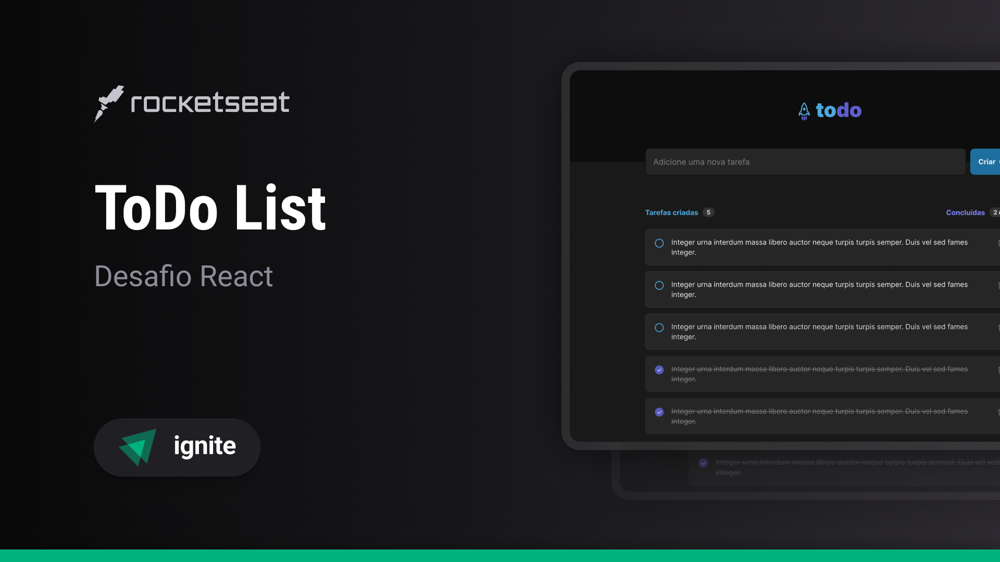

<div align="center">
  <h1>ToDo List</h1>
  <p>Esse projeto foi feito como parte de um desafio prático da <a href="https://rocketseat.com.br" target="_blank">Rocketseat</a>. O projeto utiliza as tecnologias React, TypeScript, CSS e HTML.</p>

  <p>
    
  </p>

  
</div>

---

## 📝 Funcionalidades

- Sistema de criação de tarefas.
- Possibilidade de marcar ou desmarcar a tarefa como concluída, além da opção de exclui-la.
- Design **responsivo**, garantindo uma boa experiência em dispositivos móveis, tablets e desktops.

## 🚀 Tecnologias

As principais tecnologias e ferramentas utilizadas no projeto incluem:

- **React** para dividir o projeto em partes, com componentes.
- **TypeScript** para adicionar tipagem estática ao JavaScript.
- **CSS** para estilização personalizada.
- **HTML** para a estrutura base.

## 📦 Instalação e execução

Siga os passos abaixo para instalar e executar o projeto em sua máquina local:

1. Clone o repositório:

   ```bash
   git clone https://github.com/rodrigolevino/ToDo-List.git
   cd sua_pasta
2. Instale as dependências do projeto:
   ```bash
   npm install
3. Inicie o servidor de desenvolvimento:
   ```bash
   npm run dev
4. Acesse o projeto em seu navegador no endereço:
   ```bash
   http://localhost:5001 
   ```
> **Nota:** Certifique-se de ter o **Node.js** instalado em sua máquina, pois o npm é fornecido junto com ele.


📝 Licença
Este projeto está sob a licença MIT. Consulte o arquivo LICENSE para mais informações.

